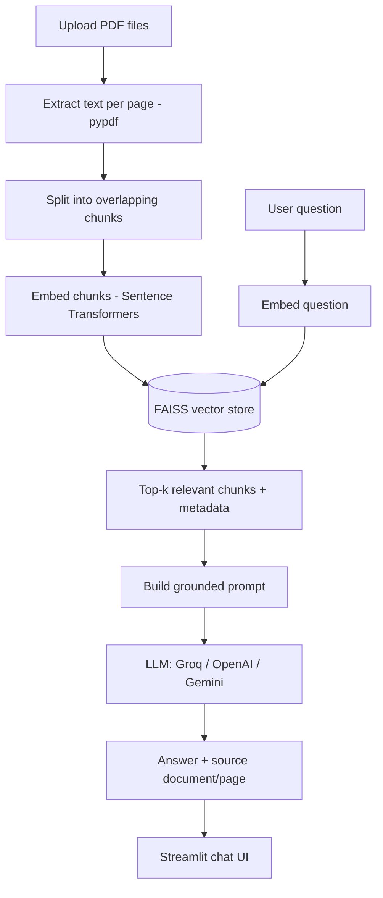

# Domain-Specific RAG Chatbot for PDF Question Answering

A Retrieval-Augmented Generation (RAG) chatbot that answers questions from
user-uploaded PDF documents (course notes, company policies, manuals, legal
documents, training material, etc.) and cites the source document and page
for every grounded answer. Built with Streamlit, pypdf, Sentence
Transformers, and FAISS.

## Features

- Upload one or more PDF files (sidebar), with file type/size validation.
- Extracts text page-by-page, keeping document + page number as metadata.
- Splits text into overlapping chunks (700-1000 chars, ~150 char overlap).
- Embeds chunks with `all-MiniLM-L6-v2` and indexes them in FAISS.
- Retrieves the top-k most relevant chunks for each question.
- Sends the retrieved context + question to an LLM (Groq / OpenAI / Gemini)
  with a strict "answer only from context" prompt.
- Displays the answer with the source document(s) and page number(s).
- Refuses to answer ("I could not find this information in the uploaded
  documents.") when nothing relevant is retrieved.
- Persists the FAISS index to disk so it survives app restarts.
- Works fully offline (no API key) via a built-in extractive fallback mode,
  and even without `torch`/`sentence-transformers` available, via a
  dependency-free hashing embedder fallback - see [Notes on portability](#notes-on-portability).

## Architecture



## Project Structure

```
MP3/
|-- app.py                 # Streamlit UI (Module 7)
|-- rag_pipeline.py         # Orchestrates extraction -> chunking -> retrieval -> answer
|-- document_loader.py      # Module 1 & 2: upload validation + PDF text extraction
|-- vector_store.py          # Module 3 & 4: chunking + FAISS-backed vector store
|-- text_splitter.py        # Dependency-free recursive character text splitter
|-- embeddings.py           # Sentence Transformers wrapper + offline fallback
|-- llm_provider.py         # Groq / OpenAI / Gemini abstraction + offline fallback
|-- prompt.py                # Module 6: grounded-answer system prompt / guardrail
|-- requirements.txt
|-- README.md
|-- .env.example
|-- .gitignore
|-- documents/               # Sample PDFs (Policy.pdf, Handbook.pdf)
|-- vector_store/saved_index/ # Persisted FAISS index (gitignored contents)
`-- tests/
    |-- generate_sample_pdfs.py
    |-- test_questions.csv    # 19-question evaluation sheet
    `-- test_rag_pipeline.py  # Automated pytest suite
```

## Setup

1. Create and activate a virtual environment, then install dependencies:

   ```bash
   python -m venv .venv
   .venv/Scripts/activate   # Windows
   pip install -r requirements.txt
   ```

2. Copy `.env.example` to `.env` and fill in one LLM provider's API key:

   ```bash
   cp .env.example .env
   ```

   | Provider | Env var         | Get a key                              |
   |----------|-----------------|-----------------------------------------|
   | Groq     | `GROQ_API_KEY`  | https://console.groq.com/keys           |
   | OpenAI   | `OPENAI_API_KEY`| https://platform.openai.com/api-keys    |
   | Gemini   | `GEMINI_API_KEY`| https://aistudio.google.com/apikey      |

   Set `LLM_PROVIDER` to `groq`, `openai`, or `gemini` to match. If you skip
   this step entirely, the app still runs end-to-end: it will show the most
   relevant retrieved passage instead of an LLM-generated answer.

3. Run the app:

   ```bash
   streamlit run app.py
   ```

4. In the sidebar, upload one or more PDFs, click **Process Documents**, then
   ask questions in the chat box. Try the sample documents in `documents/`
   (a fictional company's leave policy and employee handbook).

## Testing

Run the automated pytest suite (fully offline, no API key needed):

```bash
python -m pytest tests/ -v
```

`tests/test_questions.csv` is a 19-question evaluation sheet covering
correct, incorrect, and unavailable questions, per the project's testing
methodology (retrieval accuracy, groundedness, refusal quality, source
quality). Run it automatically against the real pipeline (needs an LLM key
configured) with:

```bash
python tests/evaluate.py
```

This grades every question against its expected source/refusal, writes
`tests/evaluation_results.csv`, and prints a summary (retrieval accuracy,
refusal accuracy, average response time) - a checked-in run currently scores
19/19 (100%).

## Responsible AI & Security

- Answers are generated only from uploaded document content; the system
  prompt instructs the LLM to refuse rather than invent facts.
- Text retrieved from uploaded documents is treated as untrusted data, never
  as instructions - the prompt explicitly tells the LLM to ignore any
  embedded instructions found inside document content.
- File uploads are limited to PDFs up to 25 MB each.
- API keys are read from environment variables / `.env` (gitignored) and are
  never logged or displayed in the UI.
- The UI displays a standing reminder to verify high-stakes information
  rather than trusting the chatbot outright.

## Notes on portability

`all-MiniLM-L6-v2` (via `sentence-transformers`/`torch`) is the intended,
semantically accurate embedding model. Some locked-down Windows environments
(corporate machines with an Application Control / WDAC policy) block torch's
native DLLs outright. To keep the app fully functional there, `embeddings.py`
automatically falls back to a deterministic, dependency-free hashing
embedder with reduced semantic accuracy if the real model can't be loaded -
you'll see a `RuntimeWarning` in the logs when this happens. On a normal
machine or a standard deployment target (Streamlit Cloud, Docker, etc.) the
real Sentence Transformers model is used automatically.

## Viva / Talking Points

See the original project brief for suggested viva questions (What is RAG?
Why chunk documents? What is an embedding? etc.) - this implementation is a
direct, complete build of the "Domain-Specific RAG Chatbot" specification,
covering all 7 modules and all 9 minimum features.
