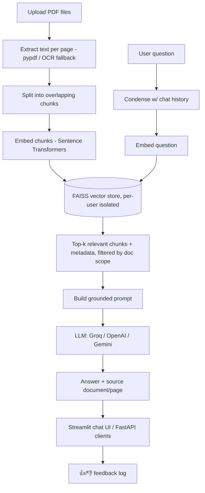

# Domain-Specific RAG Chatbot for PDF Question Answering

A Retrieval-Augmented Generation (RAG) chatbot that answers questions from
user-uploaded PDF documents (course notes, company policies, manuals, legal
documents, training material, etc.) and cites the source document and page
for every grounded answer. Built with Streamlit, pypdf, Sentence
Transformers, and FAISS - and extended with every optional advanced feature
from the project brief: conversation memory, document filters, feedback
buttons, a FastAPI backend, user login with document isolation, OCR, Docker
deployment, and an automated evaluation harness.

## Core Features (Modules 1-7)

- Upload one or more PDF files (sidebar), with file type/size validation.
- Extracts text page-by-page, keeping document + page number as metadata.
- Splits text into overlapping chunks (700-1000 chars, ~150 char overlap).
- Embeds chunks with `all-MiniLM-L6-v2` and indexes them in FAISS.
- Retrieves the top-k most relevant chunks for each question, using a
  backend-calibrated relevance gate so weakly-related content doesn't slip
  through as a false positive.
- Sends the retrieved context + question to an LLM (Groq / OpenAI / Gemini)
  with a strict "answer only from context" prompt that treats document
  content as untrusted data, never as instructions.
- Displays the answer with the source document(s), page number(s), and
  similarity scores.
- Refuses to answer ("I could not find this information in the uploaded
  documents.") when nothing relevant is retrieved.
- Persists the FAISS index to disk so it survives app restarts.
- Works fully offline (no API key) via a built-in extractive fallback mode,
  and even without `torch`/`sentence-transformers` available, via a
  dependency-free hashing embedder fallback - see [Notes on portability](#notes-on-portability).
- Normalizes text extracted from tables/diagrams that pypdf renders one word
  per line (a real PDF-layout artifact) back into natural phrases before
  chunking, since that noise otherwise degrades embedding quality - see
  `document_loader._normalize_extracted_text()`.

## Interface

A custom-themed Streamlit UI (see `.streamlit/config.toml` and the CSS in
`app.py`): a status badge row (LLM provider, indexed documents/chunks, OCR
readiness), card-based sidebar sections, live multi-step progress while
documents are processed (`st.status`, driven by `RAGPipeline`'s
`on_progress` callback - a visible illustration of the RAG pipeline's
stages), a friendly empty state with example-question chips, and
grid-style source citation cards.

## Optional Advanced Features

| Feature | Where |
|---|---|
| Conversation memory for follow-ups | `llm_provider.condense_question()`, wired through `app.py`'s chat history |
| Multiple documents + search filters | `vector_store.py`'s `allowed_documents`, the sidebar "Search scope" multiselect |
| Feedback buttons (👍/👎) | `feedback.py`, logged to `feedback/feedback_log.jsonl` |
| FastAPI backend for other clients | `api.py` - `/health`, `/documents`, `/ask` |
| User login + document isolation | `auth.py`, `tools/manage_users.py` - opt-in, no prompt until you create an account |
| OCR for scanned PDFs | `ocr.py` - opt-in checkbox, degrades gracefully without Tesseract installed |
| Docker deployment | `Dockerfile`, `docker-compose.yml` |
| Evaluation against a QA dataset | `tests/evaluate.py` against `tests/test_questions.csv` |

Batches of questions pasted into one chat message are also split and
answered individually, rather than starving most of them of retrieved
context.

## Architecture



## Project Structure

```
MP3/
|-- app.py                  # Streamlit UI (Module 7) + login gate, filters, feedback
|-- api.py                  # Optional: FastAPI backend for other clients
|-- rag_pipeline.py         # Orchestrates extraction -> chunking -> retrieval -> answer
|-- document_loader.py      # Module 1 & 2: upload validation + PDF text extraction
|-- vector_store.py         # Module 3 & 4: chunking + FAISS-backed vector store
|-- text_splitter.py        # Dependency-free recursive character text splitter
|-- embeddings.py           # Sentence Transformers wrapper + offline fallback
|-- llm_provider.py         # Groq / OpenAI / Gemini abstraction + follow-up condensing
|-- prompt.py               # Module 6: grounded-answer system prompt / guardrail
|-- logging_config.py       # Shared backend logging setup
|-- auth.py                 # Optional: login gate + per-user document isolation
|-- feedback.py             # Optional: 👍/👎 feedback logging
|-- ocr.py                  # Optional: OCR fallback for scanned PDF pages
|-- tools/
|   `-- manage_users.py     # CLI to add/remove login accounts
|-- Dockerfile, docker-compose.yml, .dockerignore
|-- requirements.txt        # Runtime dependencies
|-- requirements-dev.txt    # + test-only dependencies (pytest, reportlab)
|-- README.md
|-- PROJECT_REPORT.md
|-- .env.example
|-- .gitignore
|-- documents/               # Sample PDFs (Policy.pdf, Handbook.pdf)
|-- vector_store/saved_index/ # Persisted FAISS index (per-user subdirs; gitignored contents)
`-- tests/
    |-- generate_sample_pdfs.py
    |-- test_questions.csv      # 19-question evaluation sheet
    |-- evaluate.py             # Automated grading against test_questions.csv
    |-- evaluation_results.csv  # A checked-in real run: 19/19 (100%)
    |-- test_rag_pipeline.py    # Core pipeline tests
    |-- test_auth.py, test_feedback.py, test_api.py, test_ocr.py
```

## Setup

1. Create and activate a virtual environment, then install dependencies:

   ```bash
   python -m venv .venv
   .venv/Scripts/activate   # Windows
   pip install -r requirements.txt
   ```

2. Copy `.env.example` to `.env` and fill in one LLM provider's API key:

   ```bash
   cp .env.example .env
   ```

   | Provider | Env var         | Get a key                              |
   |----------|-----------------|-----------------------------------------|
   | Groq     | `GROQ_API_KEY`  | https://console.groq.com/keys           |
   | OpenAI   | `OPENAI_API_KEY`| https://platform.openai.com/api-keys    |
   | Gemini   | `GEMINI_API_KEY`| https://aistudio.google.com/apikey      |

   Set `LLM_PROVIDER` to `groq`, `openai`, or `gemini` to match. If you skip
   this step entirely, the app still runs end-to-end: it will show the most
   relevant retrieved passage instead of an LLM-generated answer.

3. Run the app:

   ```bash
   streamlit run app.py
   ```

4. In the sidebar, upload one or more PDFs, click **Process Documents**, then
   ask questions in the chat box. Try the sample documents in `documents/`
   (a fictional company's leave policy and employee handbook).

### Optional: enable login + document isolation

By default the app has no login prompt at all - anyone who can reach it
shares one document collection. To turn on a login gate (each user then gets
their own isolated set of uploaded documents), create an account:

```bash
python tools/manage_users.py add alice "a real password"
```

The next time the app starts, it'll show a sign-in form. Manage more
accounts with `manage_users.py list` / `remove <username>`.

### Optional: run the FastAPI backend

```bash
uvicorn api:app --reload --port 8000
```

See the interactive docs at http://localhost:8000/docs. Set `API_KEY` in
`.env` to require an `X-API-Key` header on requests (unset by default - no
gate, for local/dev use).

### Optional: OCR for scanned PDFs

Tick "Enable OCR for scanned pages" in the sidebar. This requires the
Tesseract OCR engine installed separately on your machine (not a pip
package):

- Windows: installer at https://github.com/UB-Mannheim/tesseract/wiki
- macOS: `brew install tesseract`
- Linux: `apt-get install tesseract-ocr`

Without Tesseract installed, the checkbox is harmless - scanned pages are
skipped exactly as they are today, with a warning shown in the sidebar.

### Optional: Docker

```bash
docker compose up --build
```

Runs both the Streamlit app (port 8501) and the FastAPI backend (port 8000)
with persistent named volumes. A plain Streamlit-only container also works:

```bash
docker build -t rag-chatbot .
docker run -p 8501:8501 --env-file .env -v rag_data:/app/vector_store/saved_index rag-chatbot
```

Note: Docker isn't installed on the machine this was built on, so the
Dockerfile/Compose setup is written carefully against documented syntax but
hasn't been build-tested here - please report an issue if something doesn't
build cleanly.

## Testing

Run the automated pytest suite (fully offline, no API key needed):

```bash
pip install -r requirements-dev.txt
python -m pytest tests/ -v
```

40 tests cover the core pipeline, question splitting, source deduplication,
the login gate and password hashing, feedback logging, the FastAPI backend,
and the OCR fallback's graceful degradation.

`tests/test_questions.csv` is a 19-question evaluation sheet covering
correct, incorrect, and unavailable questions, per the project's testing
methodology (retrieval accuracy, groundedness, refusal quality, source
quality). Run it automatically against the real pipeline (needs an LLM key
configured) with:

```bash
python tests/evaluate.py
```

This grades every question against its expected source/refusal, writes
`tests/evaluation_results.csv`, and prints a summary (retrieval accuracy,
refusal accuracy, average response time) - a checked-in run currently scores
19/19 (100%).

## Responsible AI & Security

- Answers are generated only from uploaded document content; the system
  prompt instructs the LLM to refuse rather than invent facts.
- Text retrieved from uploaded documents is treated as untrusted data, never
  as instructions - the prompt explicitly tells the LLM to ignore any
  embedded instructions found inside document content (tested against a
  literal prompt-injection question in `test_questions.csv`).
- File uploads are limited to PDFs up to 25 MB each.
- API keys and login credentials are read from environment variables / local
  files (`.env`, `users.json` - both gitignored) and are never logged or
  displayed in the UI; passwords are salted and hashed (PBKDF2), never
  stored in plaintext.
- When login is enabled, each user's documents are isolated in their own
  vector store subdirectory - one user's uploads are never visible to
  another.
- The UI displays a standing reminder to verify high-stakes information
  rather than trusting the chatbot outright.

## Notes on portability

`all-MiniLM-L6-v2` (via `sentence-transformers`/`torch`) is the intended,
semantically accurate embedding model. Some locked-down Windows environments
(corporate machines with an Application Control / WDAC policy) block torch's
native DLLs outright. To keep the app fully functional there, `embeddings.py`
automatically falls back to a deterministic, dependency-free hashing
embedder with reduced semantic accuracy if the real model can't be loaded -
you'll see a `RuntimeWarning` in the logs when this happens. On a normal
machine or a standard deployment target (Streamlit Cloud, Docker, etc.) the
real Sentence Transformers model is used automatically. Retrieval relevance
thresholds in `rag_pipeline.py` are calibrated separately for each backend.

## Viva / Talking Points

See the original project brief for suggested viva questions (What is RAG?
Why chunk documents? What is an embedding? etc.) - this implementation is a
complete build of the "Domain-Specific RAG Chatbot" specification, covering
all 7 modules, all 9 minimum features, and all 8 optional advanced features
listed in the brief.
